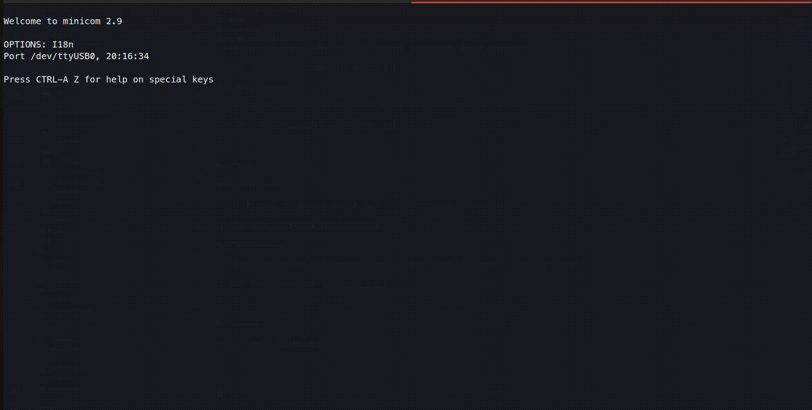
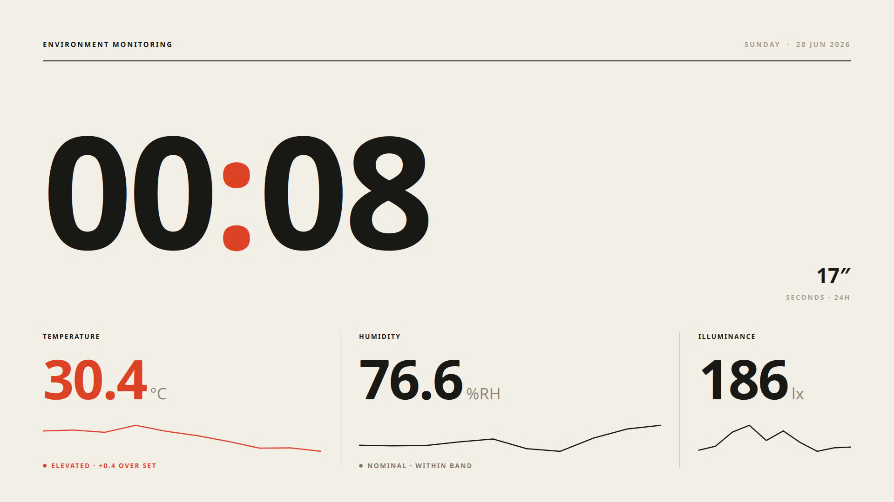
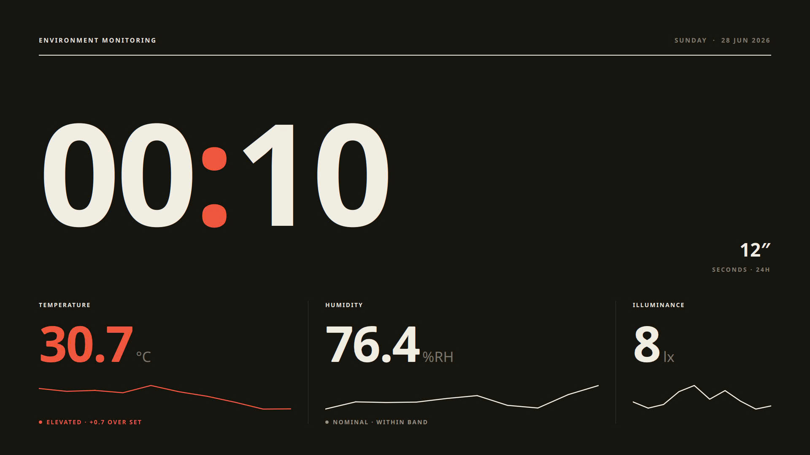

# beaglebone-optimal

A self-study Yocto Project Board Support Package (BSP) workspace for BeagleBone Black / TI AM335x.


This repository provides a reproducible, Docker-isolated workspace for building and developing Yocto-based BSPs for the BeagleBone Black. It keeps all heavy build data, caches, and sources outside the source tree to ensure a clean git repository.

---

## Key Features

Quick overview — see each subsection below for details.

| Area | Highlight |
|---|---|
| [Build host](#docker-isolated-build-host) | Docker-isolated, clean git tree, automated `format`/`check` lint gates |
| [Boot path](#optimized-fast-boot-hdmi-path) | ~1.3s kernel→shell, HDMI HPD debounce, instrumented boot-timing harness |
| [Distro catalog](#multi-target-boot--distro-catalog) | Baseline / Tiny / Qt product images from one repo |
| [Env sensor driver](#custom-environment-platform-driver-optimal-env-manager) | SHT3x + BH1750 kernel module with sysfs + chardev + IOCTL API |
| [Qt kiosk dashboard](#responsive-qt6-kiosk-dashboard) | Fullscreen QML UI on raw framebuffer, ambient theme, live charts |
| [Dev netboot](#qt-dashboard-dev-netboot-tftpnfs) | TFTP kernel/dtb + NFS rootfs over USB gadget — iterate without reflashing the SD card |

### Docker-Isolated Build Host

- Reproducible, containerized dev environment; maps host `UID`/`GID` to avoid file permission conflicts.
- Keeps the git repository clean — all build caches (`downloads`, `sstate-cache`), workspace files, and build directories live outside the source tree via a host-side `PROJECT_STORAGE_ROOT`.
- `make format` / `make check` wire `clang-format`, `shfmt`, and `shellcheck` into standard commands.

### Optimized Fast-Boot HDMI Path

- Kernel space boot to user space shell (BusyBox `sh` prompt) in **~1.3 seconds** — measured directly from `Starting kernel ...` to the login prompt, not eyeballed.
- Kernel driver patch debounces transient HDMI Hotplug (HPD) signal drops on the IT66122 transmitter.
- Environment manager kernel module loads automatically on boot; the kiosk app runs directly via BusyBox init respawn — no systemd, Wayland, or X11 overhead.
- Instrumented boot-timing harness (`make boot-capture`, see [Run Book](docs/_RUNBOOK_EN.md#boot-timing-capture-make-boot-capture)): timestamps every serial boot line at the host and adds a `/dev/kmsg`-based first-frame marker inside the Qt app, so kernel/init time and Qt startup time are measured and attributed separately instead of guessed from one end-to-end number.

### Multi-Target Boot & Distro Catalog

- **Baseline Path** — standard BeagleBone Black SD card boot (`core-image-minimal`), built via Yocto and flashed as a full-disk `.wic` image.
- **Tiny Path** — initramfs-only system (`core-image-optimal-tiny-initramfs`) using `linux-yocto-tiny` for minimal footprint and fast boot, flashed onto a single FAT partition.
- **Product Qt Path** — dedicated product layer (`meta-beaglebone-optimal-product`) targeting BeagleBone Black explicitly, stripping unused desktop/audio/network services for a secure, local-only fullscreen dashboard appliance.
- **Dev Netboot Path** (`beaglebone-black-optimal-qt-dashboard-dev`, DEV ONLY) — same Qt product image, but boots the kernel/dtb via TFTP and mounts the rootfs via NFS over USB gadget instead of an SD card, for fast local iteration. See [Qt Dashboard Dev Netboot](#qt-dashboard-dev-netboot-tftpnfs).

### Custom Environment Platform Driver (`optimal-env-manager`)

- Aggregates real-time measurements in kernel space from SHT3x (temperature/humidity) and BH1750 (ambient light) sensors.
- Exposes a **sysfs API** (`/sys/class/optimal-env/...`) — read-only sensor metrics, hardware health diagnostic flags (bitmask), and read-write threshold limits (`temp_alarm_limit`, `humid_alarm_limit`, `lux_alarm_limit`).
- Publishes a packed binary 10-point measurement history via a custom character device (`/dev/optimal_env`) with custom IOCTLs (`OP_ENV_IOCTL_CLEAR_HISTORY`, `OP_ENV_IOCTL_TRIGGER_MEASURE`) — see [Kernel-Userspace Integration Details](docs/product-contract-qt-dashboard.md#kernel-userspace-integration-details).
- Triggers direct GPIO alerts, pulsing the onboard `USR1` (temperature) and `USR2` (humidity) LEDs at a **50ms** flash interval on threshold violation.

### Responsive Qt6 Kiosk Dashboard

- Lightweight fullscreen QML UI running directly on the raw framebuffer (`linuxfb`).
- **Ambient-responsive theme switching** (slate-dark `#0F172A` vs. clean white) mapped to the kernel's `night_mode` status.
- **Real-time historical charts** for temperature, humidity, and ambient light, rendered with HTML5 Canvas from `/dev/optimal_env` logs.
- **Visual alert indicators** — pulsing border animations and warning badges when thresholds are breached.
- **System clock & seconds progress ring**, synchronized on startup from the high-accuracy DS3231 RTC.

### Qt Dashboard Dev Netboot (TFTP/NFS)

- A dev-only machine (`beaglebone-black-optimal-qt-dashboard-dev`) built for fast iteration: U-Boot TFTP-boots the kernel/dtb and mounts the rootfs over NFS, so a code change only needs a rebuild + sync, not a full SD card reflash.
- Transport is **USB gadget** (RNDIS/CDC-ECM), not wired Ethernet — the board's own onboard CPSW RJ45 port has no software workaround available on this hardware.
- Host-side setup (`make netboot-host-setup`, `netboot-seed-rootfs`, `netboot-sync-app`, `netboot-sync-kernel`) and full operational details, including known USB gadget quirks and their fixes, are documented in the [Run Book](docs/_RUNBOOK_EN.md#qt-dashboard-dev-netboot-flow-dev-only).

---

## Getting Started

### 1. Prerequisites

Ensure your host machine has:

- **Docker Engine** and **Docker Compose** plugin.
- The current host user added to the `docker` group.

### 2. Initial Setup

Clone the repository and copy the environment configuration:

```bash
cp local.mk.example local.mk
```

Edit `local.mk` and configure `PROJECT_STORAGE_ROOT` pointing to an absolute host path (e.g., `/mnt/data/beaglebone-optimal`). Do not commit `local.mk`.

Verify the configuration and directory structure:

```bash
make doctor
```

### 3. Initialize and Build Yocto

#### Option A: Baseline Path (core-image-minimal)

1. Open the builder shell:
   ```bash
   make docker-shell
   ```
2. Clone `poky` inside `/workspace/yocto/sources`:
   ```bash
   mkdir -p "$YOCTO_SOURCES_DIR" && cd "$YOCTO_SOURCES_DIR"
   git clone -b scarthgap https://git.yoctoproject.org/poky
   ```
3. Initialize the build directory:
   ```bash
   make yocto-init
   ```
4. Apply example config files:
   ```bash
   cp yocto/conf/bblayers.conf.example "$YOCTO_BUILD_DIR/conf/bblayers.conf"
   cat yocto/conf/local.conf.example >> "$YOCTO_BUILD_DIR/conf/local.conf"
   ```
5. Trigger the build:
   ```bash
   make yocto-build
   ```
6. Flash to an SD card:
   ```bash
   make sd-flash SDCARD=/dev/sdX
   ```

#### Option B: Tiny Path (core-image-optimal-tiny-initramfs)

1. Follow the baseline clone steps above to fetch `poky`.
2. Initialize and apply the tiny configuration:
   ```bash
   make yocto-init
   cp yocto/conf/bblayers.conf.tiny.example "$YOCTO_BUILD_DIR/conf/bblayers.conf"
   cat yocto/conf/local.conf.tiny.example >> "$YOCTO_BUILD_DIR/conf/local.conf"
   ```
3. Build the tiny image:
   ```bash
   make yocto-parse
   make yocto-dry-run YOCTO_IMAGE=core-image-optimal-tiny-initramfs
   make yocto-build YOCTO_IMAGE=core-image-optimal-tiny-initramfs
   ```
4. Flash the single FAT boot partition:
   ```bash
   make sd-flash-tiny SDCARD=/dev/sdX
   ```

#### Option C: Qt Dashboard Product Path

1. Keep the existing baseline and tiny BSP flow intact.
2. Add an upstream `meta-qt6` checkout beside `poky` under `"$YOCTO_SOURCES_DIR"`.
3. Initialize the build directory and apply the product path examples:
   ```bash
   make yocto-init
   cp yocto/conf/bblayers.conf.qt-dashboard.example "$YOCTO_BUILD_DIR/conf/bblayers.conf"
   cat yocto/conf/local.conf.qt-dashboard.example >> "$YOCTO_BUILD_DIR/conf/local.conf"
   ```
4. Build the scaffolded product image path:
   ```bash
   make yocto-parse
   make yocto-qt-profile
   make yocto-dry-run YOCTO_IMAGE=core-image-optimal-qt-dashboard
   make yocto-build YOCTO_IMAGE=core-image-optimal-qt-dashboard
   ```
5. Flash the BBB Black product image:
   ```bash
   make sd-flash \
     YOCTO_MACHINE=beaglebone-black-optimal-qt-dashboard \
     YOCTO_IMAGE=core-image-optimal-qt-dashboard \
     SDCARD=/dev/sdX
   ```

This product path defines a minimal appliance-style Qt profile:

- tiny remains headless and does not own HDMI/display behavior
- the BSP layer (`meta-beaglebone-optimal`) enables the HDMI hardware display drivers and device tree, while the product layer (`meta-beaglebone-optimal-product`) handles the application software and Distro configurations
- the product path now targets BeagleBone Black explicitly instead of the
  generic `beaglebone-yocto` machine
- runtime display defaults live in `qt-dashboard.sh`
- build-time feature trimming lives in the Yocto product layer and
  `local.conf.qt-dashboard.example`
- build-time policy drops desktop, audio, and service-discovery stacks that do
  not help a local-only fullscreen dashboard appliance

Hardware HDMI proof is still required on the real board before claiming the
dashboard runtime is proven end-to-end.

---

## Quality and Linting

Run checks locally before committing changes:

```bash
make format  # Auto-formats shell and C/C++ files
make check   # Runs style checks and linters
```

---

## Project Contracts and Documentation

Detailed design rules and guides are located in the `docs/` directory:

- [Run Book (EN)](docs/_RUNBOOK_EN.md) / [Run Book (VN)](docs/_RUNBOOK_VN.md) - Operational instructions.
- [Boot Contract](docs/boot-contract.md) - Normative rules for kernel and bootloader boot paths.
- [Coding Style Contract](docs/coding-style.md) - Formatting and linting standards.

---

## Demo

### Docker

#### Docker Build

> Building the Docker image for the isolated development build environment.


#### Docker Shell

> Entering the interactive bash shell within the running builder container.


---

### Yocto

#### Yocto Init

> Initializing the storage-backed Yocto build directory environment.


#### Yocto Build

> Running the bitbake build process inside the container to compile the target image.


---

### Target Demo

#### Boot Log

> Real-time boot log showing the fast-boot optimization on the BeagleBone Black.



#### Qt Dashboard

> Qt UI

<p align="center">
  
  
</p>

> The responsive Qt6 kiosk dashboard application running over HDMI.


---

## License

[MIT License](LICENSE.md)
