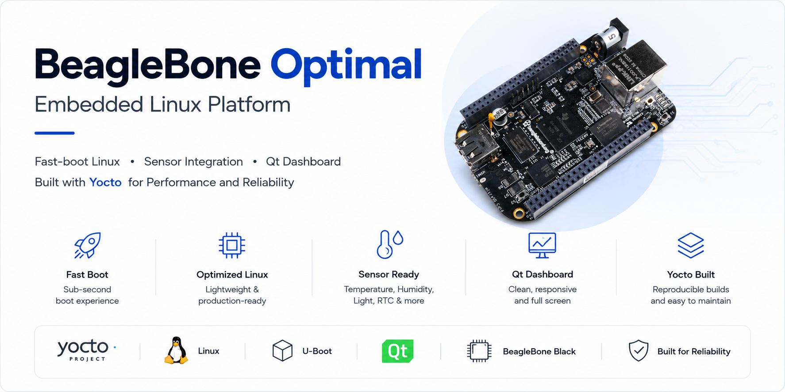
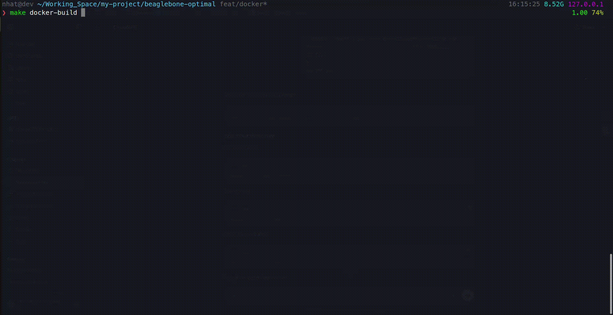
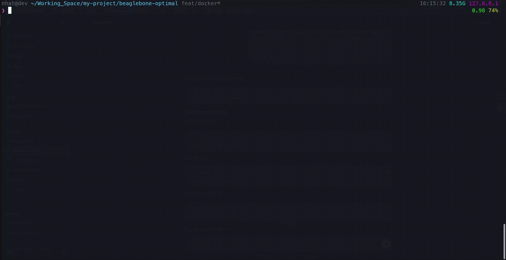
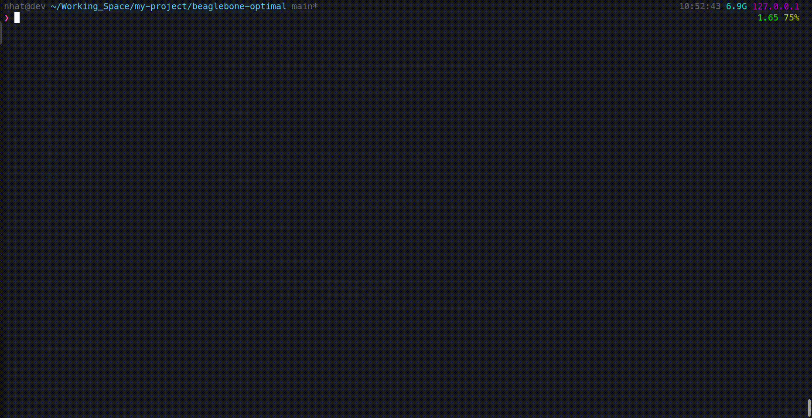
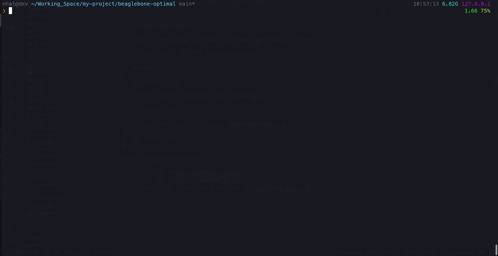

# beaglebone-optimal

A self-study Yocto Project Board Support Package (BSP) workspace for BeagleBone Black / TI AM335x.



This repository provides a reproducible, Docker-isolated workspace for building and developing Yocto-based BSPs for the BeagleBone Black. It keeps all heavy build data, caches, and sources outside the source tree to ensure a clean git repository.

---

## Key Features

- **Docker-Isolated Build Host:**
  - Provides a reproducible, containerized development environment mapping host `UID`/`GID` to avoid file permissions conflicts.
  - Keeps the git repository clean by storing all build caches (`downloads`, `sstate-cache`), workspace files, and build directories outside the source tree via a host-side `PROJECT_STORAGE_ROOT`.
  - Integrates automated quality check gates mapping `clang-format`, `shfmt`, and `shellcheck` static code analysis directly to standard `make format` and `make check` commands.
- **Optimized Fast-Boot HDMI Paths:**
  - Reaches kernel space boot to user space startup in **only 1.5 seconds**.
  - Launches the fullscreen Qt dashboard application over HDMI output in **4.0 seconds** total (excluding the 3s U-Boot delay).
  - Utilizes a kernel driver patch to debounce transient HDMI Hotplug (HPD) signal drops on the IT66122 transmitter.
  - Automatically loads the environment manager kernel module on boot and runs the kiosk application directly via BusyBox init respawn (bypassing systemd, Wayland, or X11 to save boot overhead).
- **Multi-Target Boot & Distro Catalog:**
  - **Baseline Path:** Standard BeagleBone Black SD card boot (`core-image-minimal`) built via Yocto and flashed as a full-disk `.wic` image.
  - **Tiny Path:** Highly optimized, initramfs-only system (`core-image-optimal-tiny-initramfs`) using `linux-yocto-tiny` for extremely fast boot times and a minimal footprint, flashing boot artifacts onto a single FAT partition.
  - **Product Qt Path:** Dedicated product layer (`meta-beaglebone-optimal-product`) targeting the BeagleBone Black explicitly, stripping out unused desktop packages, audio, and network services for a secure, local-only fullscreen dashboard appliance.
- **Custom Environment Platform Driver (`optimal-env-manager`):**
  - Aggregates real-time measurements in kernel-space from target SHT3x (temperature/humidity) and BH1750 (ambient light) sensors.
  - Exposes a **Sysfs API** (`/sys/class/optimal-env/...`) featuring read-only sensor metrics, hardware health diagnostic flags (bitmask), and read-write threshold limits (`temp_alarm_limit`, `humid_alarm_limit`, `lux_alarm_limit`).
  - Publishes a packed binary 10-point measurement history log via a custom character device node (`/dev/optimal_env`) supporting custom IOCTL controls (`OP_ENV_IOCTL_CLEAR_HISTORY` and `OP_ENV_IOCTL_TRIGGER_MEASURE`) (see [Kernel-Userspace Integration Details](docs/product-contract-qt-dashboard.md#kernel-userspace-integration-details)).
  - Triggers direct GPIO-based alerts, pulsing the onboard `USR1` LED (Temperature Alert) and `USR2` LED (Humidity Alert) at a rapid **50ms flash interval** on threshold violation.
- **Responsive Qt6 Kiosk Dashboard:**
  - Operates a lightweight fullscreen QML UI directly on the raw framebuffer (`linuxfb`).
  - Implements **ambient-responsive theme switching** (slate-dark `#0F172A` vs. clean white layout) mapped to the kernel's `night_mode` status.
  - Draws **real-time historical charts** for temperature, humidity, and ambient light using HTML5 Canvas elements sourced from `/dev/optimal_env` logs.
  - Features **visual alert indicators**, including pulsing border animations and warnings badges when alerts are triggered.
  - Displays a **system clock & seconds progress ring** synchronized automatically with the high-accuracy DS3231 RTC on startup.

---

## Getting Started

### 1. Prerequisites

Ensure your host machine has:

- **Docker Engine** and **Docker Compose** plugin.
- The current host user added to the `docker` group.

### 2. Initial Setup

Clone the repository and copy the environment configuration:

```bash
cp local.mk.example local.mk
```

Edit `local.mk` and configure `PROJECT_STORAGE_ROOT` pointing to an absolute host path (e.g., `/mnt/data/beaglebone-optimal`). Do not commit `local.mk`.

Verify the configuration and directory structure:

```bash
make doctor
```

### 3. Initialize and Build Yocto

#### Option A: Baseline Path (core-image-minimal)

1. Open the builder shell:
   ```bash
   make docker-shell
   ```
2. Clone `poky` inside `/workspace/yocto/sources`:
   ```bash
   mkdir -p "$YOCTO_SOURCES_DIR" && cd "$YOCTO_SOURCES_DIR"
   git clone -b scarthgap https://git.yoctoproject.org/poky
   ```
3. Initialize the build directory:
   ```bash
   make yocto-init
   ```
4. Apply example config files:
   ```bash
   cp yocto/conf/bblayers.conf.example "$YOCTO_BUILD_DIR/conf/bblayers.conf"
   cat yocto/conf/local.conf.example >> "$YOCTO_BUILD_DIR/conf/local.conf"
   ```
5. Trigger the build:
   ```bash
   make yocto-build
   ```
6. Flash to an SD card:
   ```bash
   make sd-flash SDCARD=/dev/sdX
   ```

#### Option B: Tiny Path (core-image-optimal-tiny-initramfs)

1. Follow the baseline clone steps above to fetch `poky`.
2. Initialize and apply the tiny configuration:
   ```bash
   make yocto-init
   cp yocto/conf/bblayers.conf.tiny.example "$YOCTO_BUILD_DIR/conf/bblayers.conf"
   cat yocto/conf/local.conf.tiny.example >> "$YOCTO_BUILD_DIR/conf/local.conf"
   ```
3. Build the tiny image:
   ```bash
   make yocto-parse
   make yocto-dry-run YOCTO_IMAGE=core-image-optimal-tiny-initramfs
   make yocto-build YOCTO_IMAGE=core-image-optimal-tiny-initramfs
   ```
4. Flash the single FAT boot partition:
   ```bash
   make sd-flash-tiny SDCARD=/dev/sdX
   ```

#### Option C: Qt Dashboard Product Path

1. Keep the existing baseline and tiny BSP flow intact.
2. Add an upstream `meta-qt6` checkout beside `poky` under `"$YOCTO_SOURCES_DIR"`.
3. Initialize the build directory and apply the product path examples:
   ```bash
   make yocto-init
   cp yocto/conf/bblayers.conf.qt-dashboard.example "$YOCTO_BUILD_DIR/conf/bblayers.conf"
   cat yocto/conf/local.conf.qt-dashboard.example >> "$YOCTO_BUILD_DIR/conf/local.conf"
   ```
4. Build the scaffolded product image path:
   ```bash
   make yocto-parse
   make yocto-qt-profile
   make yocto-dry-run YOCTO_IMAGE=core-image-optimal-qt-dashboard
   make yocto-build YOCTO_IMAGE=core-image-optimal-qt-dashboard
   ```
5. Flash the BBB Black product image:
   ```bash
   make sd-flash \
     YOCTO_MACHINE=beaglebone-black-optimal-qt-dashboard \
     YOCTO_IMAGE=core-image-optimal-qt-dashboard \
     SDCARD=/dev/sdX
   ```

This product path defines a minimal appliance-style Qt profile:

- tiny remains headless and does not own HDMI/display behavior
- the BSP layer (`meta-beaglebone-optimal`) enables the HDMI hardware display drivers and device tree, while the product layer (`meta-beaglebone-optimal-product`) handles the application software and Distro configurations
- the product path now targets BeagleBone Black explicitly instead of the
  generic `beaglebone-yocto` machine
- runtime display defaults live in `qt-dashboard.sh`
- build-time feature trimming lives in the Yocto product layer and
  `local.conf.qt-dashboard.example`
- build-time policy drops desktop, audio, and service-discovery stacks that do
  not help a local-only fullscreen dashboard appliance

Hardware HDMI proof is still required on the real board before claiming the
dashboard runtime is proven end-to-end.

---

## Quality and Linting

Run checks locally before committing changes:

```bash
make format  # Auto-formats shell and C/C++ files
make check   # Runs style checks and linters
```

---

## Project Contracts and Documentation

Detailed design rules and guides are located in the `docs/` directory:

- [Run Book (EN)](docs/_RUNBOOK_EN.md) / [Run Book (VN)](docs/_RUNBOOK_VN.md) - Operational instructions.
- [Boot Contract](docs/boot-contract.md) - Normative rules for kernel and bootloader boot paths.
- [Coding Style Contract](docs/coding-style.md) - Formatting and linting standards.

---

## Demo

### Docker

#### Docker Build

> Building the Docker image for the isolated development build environment.



#### Docker Shell

> Entering the interactive bash shell within the running builder container.



---

### Yocto

#### Yocto Init

> Initializing the storage-backed Yocto build directory environment.



#### Yocto Build

> Running the bitbake build process inside the container to compile the target image.



---

### Target Demo

#### Boot Log

> Real-time boot log showing the fast-boot optimization on the BeagleBone Black.


#### Qt Dashboard

> The responsive Qt6 kiosk dashboard application running over HDMI.


---

## License

[MIT License](LICENSE.md)
